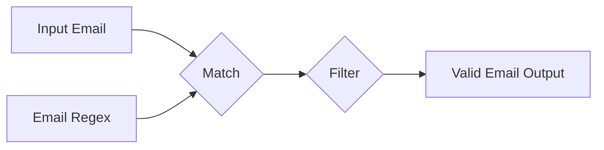

# Match

The Match node is a logic node that checks if a given string matches a specified pattern. It's useful when you need to validate or filter strings based on a particular format or regular expression.

## Inputs

1. `match` (string, default: ""): The pattern to match against. This can be a regular expression or a simple string.
2. `string` (string, default: ""): The input string to check for a match.

## Outputs

1. `result` (boolean): Returns `true` if the input string matches the specified pattern, `false` otherwise.

## Configuration

This node has no additional configuration options.

## Usage

1. Connect a string value to the `match` input to specify the pattern you want to match. This can be a regular expression or a simple string.
2. Connect the string you want to check to the `string` input.
3. The `result` output will emit `true` if the input string matches the pattern, `false` otherwise.

## Example

Let's say you have a spell that processes email addresses and you want to validate that the input is a properly formatted email address before proceeding. You can use the Match node to check the format.

1. Create a Match node and connect a Constant node with the value `^[A-Za-z0-9._%+-]+@[A-Za-z0-9.-]+\.[A-Z|a-z]{2,}$` to the `match` input. This regular expression matches common email address formats.
2. Connect the string you want to validate to the `string` input of the Match node.
3. Connect the `result` output to a Filter node. The Filter node will only pass through the original string if it matches the email format.

## Best Practices

- Use regular expressions for more complex pattern matching. Simple string matching is useful for exact matches, but regular expressions allow for much more flexibility.
- Be mindful of case sensitivity. By default, string matching is case sensitive. Use regular expression flags like `/i` for case-insensitive matching.

## Common Issues

- Forgetting to escape special characters in regular expressions. Characters like `., +, *, ?` have special meaning in regular expressions and need to be escaped with a backslash `\` to match them literally.
- Overly complex regular expressions can be difficult to read and maintain. Use comments and break complex expressions into smaller parts for better readability.