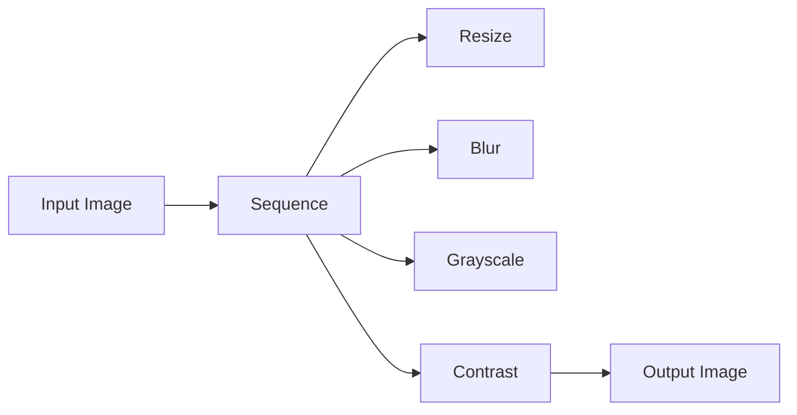

# Sequence

The Sequence node is a utility node that allows you to create a sequence of multiple output flows from a single input flow. It is useful when you need to perform a series of operations or transformations on data in a specific order.

## Inputs

- `flow` (required): The input flow that will be split into a sequence of output flows.

## Outputs

The Sequence node has a configurable number of outputs, determined by the `numOutputs` configuration option. Each output represents a step in the sequence and will receive the flow from the previous step.

## Configuration Options

- `numOutputs` (required): An integer specifying the number of output flows to create. This determines how many steps will be in the sequence.

## Usage

1. Add a Sequence node to your spell.
2. Connect the input flow to the Sequence node's `flow` input.
3. Set the desired number of outputs using the `numOutputs` configuration option.
4. Connect each output of the Sequence node to the appropriate downstream nodes representing the steps in your sequence.
5. The flow will be passed through each connected output in order, allowing you to perform a series of operations.

## Example

Suppose you have a spell that needs to perform the following steps on an input image:

1. Resize the image
2. Apply a blur effect
3. Convert to grayscale
4. Enhance the contrast

You could use a Sequence node to create this multi-step flow:

In this example, the Sequence node is configured with `numOutputs` set to 4. The input image flows through the Sequence node, which splits it into four sequential outputs. Each output is connected to a node that performs a specific transformation (Resize, Blur, Grayscale, Contrast). The final output of the sequence is the transformed image.

## Best Practices

- Use Sequence nodes to create clear, linear flows when a specific order of operations is required.
- Give each output a meaningful name that describes the step it represents.
- Keep the number of outputs reasonable to maintain readability. If your sequence is too long, consider breaking it into sub-spells.

## Common Issues

- Ensure that the `numOutputs` configuration matches the number of connected output nodes. A mismatch can lead to unexpected behavior.
- Be mindful of the order in which you connect the outputs. The sequence will execute in the order the outputs are connected.
- Remember that each step in the sequence receives the output from the previous step. Ensure that the data type and format are compatible between steps.

By using the Sequence node, you can create well-organized, step-by-step flows in your Magick spells, making your logic clear and easy to follow.