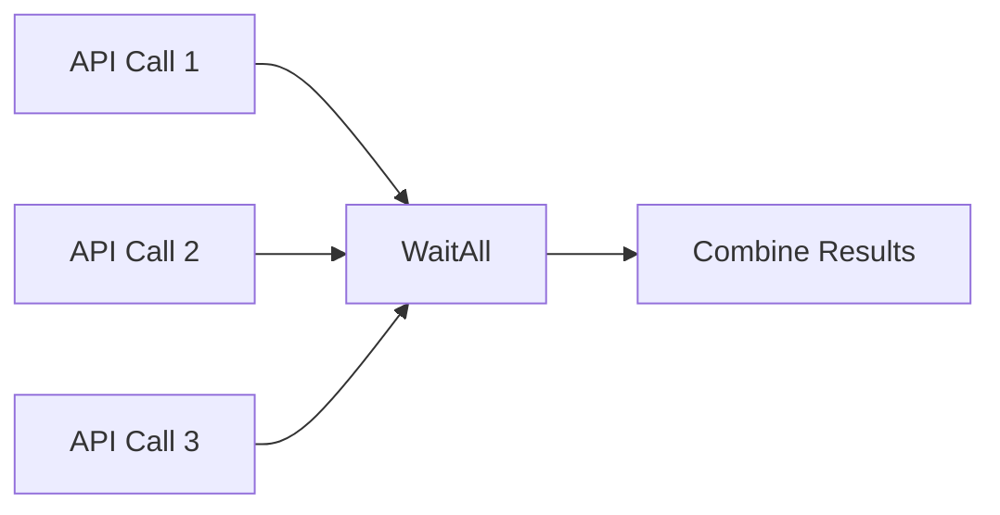

# WaitAll

The WaitAll node is a flow control node that allows you to synchronize multiple parallel branches of a spell. It waits for all connected input flows to be triggered before allowing the spell to proceed, ensuring that all prerequisite tasks are completed.

## Inputs

- `reset` (flow): An optional input that, when triggered, resets the WaitAll node, clearing any previously received signals.
- `autoReset` (boolean, default: false): When set to true, the WaitAll node will automatically reset after triggering its output, allowing it to be used multiple times within a spell without manually resetting.

## Outputs

- `flow` (flow): The output flow that is triggered once all connected input flows have been activated.

## Configuration

- `numInputs` (number, default: 3): Specifies the number of input flows the WaitAll node should expect. This value determines how many input flow ports will be available on the node.

## Usage

1. Drag and drop the WaitAll node onto your spell's canvas.
2. Connect the desired number of input flows to the WaitAll node. The number of input flows should match the `numInputs` configuration value.
3. Connect the WaitAll node's output flow to the next node in your spell.
4. If you want the WaitAll node to automatically reset after triggering its output, set the `autoReset` input to true.
5. To manually reset the WaitAll node, trigger the `reset` input flow.

## Example

Suppose you have a spell that needs to perform three independent API calls and then combine their results. You can use the WaitAll node to ensure that all API calls have completed before proceeding with the result combination.

In this example, the WaitAll node is configured with `numInputs` set to 3. Each API call node is connected to one of the WaitAll node's input flows. The WaitAll node's output flow is then connected to the "Combine Results" node. This ensures that the "Combine Results" node will only be triggered once all three API calls have completed.

## Best Practices

- Make sure to set the `numInputs` configuration value to match the number of input flows you plan to connect to the WaitAll node.
- Use the `autoReset` input when you need the WaitAll node to handle multiple synchronization points within the same spell execution.
- If you need to synchronize a variable number of input flows, consider using the WaitAny node instead.

## Common Issues

- If the WaitAll node does not seem to be triggering its output flow, double-check that all connected input flows have been activated and that the `numInputs` configuration value matches the actual number of connected inputs.
- Remember to reset the WaitAll node if you need to use it multiple times within the same spell execution and `autoReset` is not enabled.