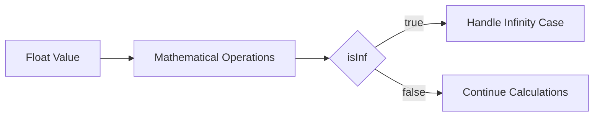

# isInf (float)

The `isInf` node checks if the input float value is positive or negative infinity. It returns `true` if the input is either positive or negative infinity, and `false` otherwise.

## Inputs

1. `a` (float, default: 0): The float value to check for infinity.

## Outputs

1. `result` (boolean): Returns `true` if the input is either positive or negative infinity, and `false` otherwise.

## Configuration

This node has no configuration options.

## Example Usage

Suppose you have a spell that performs a series of mathematical operations on a float value. You want to check if the result of these operations is infinity before proceeding with further calculations. You can use the `isInf` node to accomplish this.

### Spell Steps

1. Connect the output of your mathematical operation nodes to the `a` input of the `isInf` node.
2. Connect the `result` output of the `isInf` node to a `Branch` node.
3. Configure the `Branch` node to handle the case when `result` is `true` (infinity) and when it is `false` (not infinity).

### Example Spell

In this example, the `isInf` node is used to check if the result of the mathematical operations is infinity. If it is, the spell branches to handle the infinity case. If not, the spell continues with further calculations.

## Best Practices

- Use the `isInf` node to check for infinity when working with float values that may grow very large or very small during calculations.
- Always handle the case when `result` is `true` to avoid unexpected behavior in your spell.

## Common Issues

- Be aware that the `isInf` node only checks for positive and negative infinity. It does not check for NaN (Not-a-Number) values. Use the `isNaN` node for that purpose.
- Remember that comparing a float value directly to infinity using the equality operator (`==`) may not always work due to the way floats are represented in memory. The `isInf` node provides a reliable way to check for infinity.