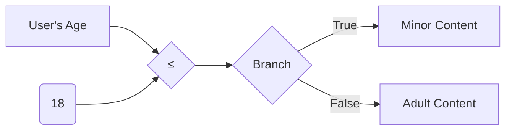

# ≤ (Less Than or Equal To)

The `≤` node compares two integer inputs and outputs a boolean value indicating whether the first input is less than or equal to the second input.

## Inputs

1. `a` (integer): The first integer to compare. Default value is 0.
2. `b` (integer): The second integer to compare. Default value is 0.

## Outputs

1. `result` (boolean): True if `a` is less than or equal to `b`, false otherwise.

## Configuration

This node has no configuration options.

## Usage

To use the `≤` node:

1. Connect integer values to the `a` and `b` input ports. These can be hardcoded values, or outputs from other nodes.
2. The node will output a boolean value to the `result` port, which you can then use as input to other nodes or as a final output of your spell.

## Example

Suppose you want to check if a user's age is less than or equal to 18 in order to determine if they are a minor. You could use the `≤` node like this:

1. Connect the user's age (e.g., from a form input or database) to the `a` port.
2. Connect the integer value 18 to the `b` port. 
3. The `result` port will output `true` if the user's age is less than or equal to 18, `false` otherwise.
4. Connect the `result` to a branch node to conditionally execute different parts of your spell based on whether the user is a minor.

Here's what that might look like in a simple spell:

## Best Practices

- Ensure that the inputs to `≤` are actually integers. Connecting other data types may lead to unexpected behavior.
- Remember that `≤` is inclusive of the second input value. If you want strict less than comparison, use the `<` node instead.

## Common Issues

- Accidentally connecting the inputs in the wrong order. Remember, the node checks if `a` is less than or equal to `b`, not the other way around.
- Forgetting to handle both the `true` and `false` cases in your spell logic. Make sure you consider what should happen in each case.