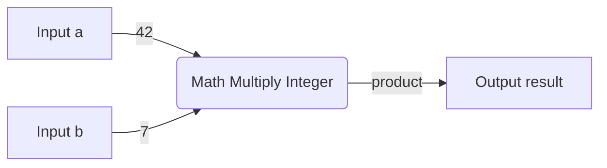

# Math Multiply Integer

The Math Multiply Integer node performs integer multiplication on two input values and outputs the result.

## Inputs

- `a` (integer): The first value to multiply. Default value is 0.
- `b` (integer): The second value to multiply. Default value is 0.

## Outputs

- `result` (integer): The product of the two input values.

## Configuration

This node has no configuration options.

## Usage

1. Add the Math Multiply Integer node to your spell.
2. Connect integer values to the `a` and `b` input ports. These can come from other nodes or be set as default values.
3. The node will output the product of `a` and `b` on the `result` port.
4. Connect the `result` to other nodes as needed in your spell.

## Example

Here's a simple example spell that multiplies two hardcoded values using the Math Multiply Integer node:

In this example:
1. The `a` input is hardcoded to the value 42. 
2. The `b` input is hardcoded to 7.
3. The Math Multiply Integer node multiplies these to get 42 * 7 = 294.
4. The result, 294, is output to the `result` port.

## Tips

- If either input is not connected, the node will use that input's default value of 0.
- You can multiply by negative numbers to perform subtraction. For example, 5 * -3 = -15.
- Multiplying any number by 0 will always result in 0.

## Caution

Be aware of the limitations of integer math. If the product of the two input values exceeds the maximum size of an integer (2,147,483,647 for signed 32-bit integers), the result will overflow without warning. If you need to handle very large numbers, consider using a floating point multiplication node instead.