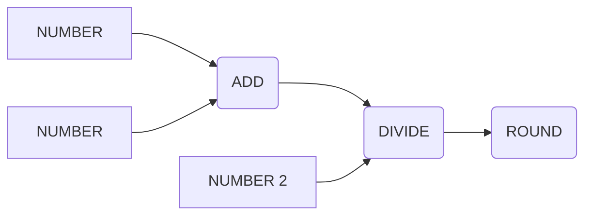

# ROUND

The ROUND node in Magick rounds a floating-point number to the nearest integer value. It's useful when you need to convert a float to an integer while minimizing rounding errors.

## Inputs

1. `a` (float, default: 0): The floating-point number to be rounded.

## Outputs

1. `result` (float): The rounded integer value.

## Configuration

This node has no configuration options.

## Usage

To use the ROUND node:

1. Connect a node that outputs a floating-point number to the `a` input of the ROUND node.
2. The rounded integer value will be available at the `result` output.
3. Connect the `result` output to the input of another node as needed.

## Example

Suppose you have a spell that calculates the average of two numbers, but you need the result as an integer. You can use the ROUND node to achieve this:

1. Connect two NUMBER nodes to the inputs of an ADD node.
2. Connect the output of the ADD node to the input of a DIVIDE node.
3. Set the second input of the DIVIDE node to 2 using another NUMBER node.
4. Connect the output of the DIVIDE node to the `a` input of a ROUND node.
5. The rounded integer average will be available at the `result` output of the ROUND node.

## Best Practices

- Use the ROUND node when you need to convert a floating-point number to an integer while minimizing rounding errors.
- Be aware that rounding can introduce small inaccuracies, especially when dealing with large numbers or numbers with many decimal places.

## Common Issues

- Make sure the input to the ROUND node is a floating-point number. Connecting a non-float input may result in unexpected behavior or errors.
- Keep in mind that rounding can change the value of the number slightly. If you need to preserve the exact value, consider using a FLOOR or CEIL node instead.