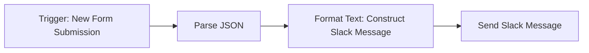

# Send Slack Message

The Send Slack Message node allows you to send a message to a Slack channel directly from your Magick spell. This is useful for sending notifications, alerts, or updates at any point in your spell's execution.

## Inputs

- `flow` (required): The flow from the previous node in the spell.
- `content` (required): The text content of the Slack message to send. This should be a string.

## Outputs

- `flow`: The flow to the next node in the spell after the Slack message has been sent.

## Configuration

This node does not have any additional configuration options.

## Usage

1. Add the Send Slack Message node to your spell.
2. Connect the `flow` input to the output of the previous node in your spell.
3. Set the `content` input to the text you want to include in your Slack message. You can enter a static string, or map it to the output of another node.
4. Connect the `flow` output to the next node in your spell, if applicable.
5. Configure your Slack API credentials in the Magick platform settings. The Send Slack Message node will use these credentials to authenticate with the Slack API and send the message.

## Example 

Here's an example of how you might use the Send Slack Message node in a spell:

1. Use a Trigger node to start the spell when a certain event occurs, such as a new form submission on your website.
2. Use a Parse JSON node to extract relevant data fields from the form submission.
3. Use a Format Text node to construct the message you want to send to Slack, incorporating the extracted data fields.
4. Use the Send Slack Message node to send the constructed message to your desired Slack channel.

## Best Practices

- Keep your Slack messages concise and to the point. Avoid sending overly long or frequent messages that could clutter the channel.
- Use the Send Slack Message node judiciously. Sending too many automated Slack messages can be disruptive to your team's workflow.
- Make sure to configure your Slack API credentials securely in the Magick platform settings. Do not hard-code sensitive credentials directly in your spell.

## Troubleshooting

- If your Slack messages are not being sent, first check that your Slack API credentials are configured correctly in the Magick platform settings.
- Ensure that the `content` input to the Send Slack Message node is a valid string. Passing invalid data types may cause the node to fail silently.
- If you're still having issues, check the Magick logs for any error messages related to the Send Slack Message node or the Slack API integration.